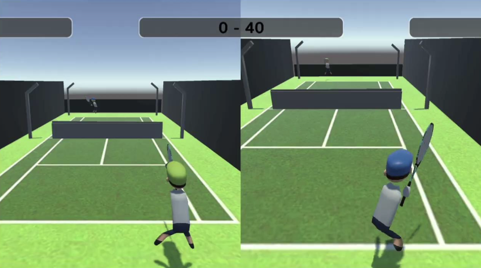

# Unity-Based Wii Tennis Game

A **3D Unity Tennis Game** with motion-based controls using a Wii remote. This project aims to provide an immersive and engaging tennis experience by leveraging **real-time physics** and **Wii Remote integration** for player interaction. The project was originally collaborated on **Unity Cloud**.

## Features

* **Supports Multiple Wii Remotes**, enabling at most **two players** to compete in multiplayer mode.
* **Diverse means of control supported,** if you don't have Wii Remote with you, playing with keyboards is available.
* **Motion-Based Gameplay**, where player actions like swinging, serving, and hitting are controlled through Wii Remote motion tracking.
* **Single and Multiplayer Modes** to allow solo practice or competitive matches.
* **UI Interface** is similar to original Wii interface.

## Installation & Setup

### Prerequisites

* **Wii Remote & Bluetooth Adapter** for motion tracking.
* **Windows/macOS** with Unity-compatible drivers for Wii remote integration.

## Controls

* **Swing Motion** - Perform a forehand/backhand using the Wii remote.
* **Serve**  (if connected to Wii Remote):
  * Press A to throw the ball in mid air
  * Swing while ball is tossed to serve.
* Serve (Not connected to Wii Remote):
  * Player 1: Press spacebar while ball is being tossed
  * Player 2: Press Enter while ball is being tossed
* **Move Player** - Player 1 moves with WASD; Player 2 moves with up, left, right, down arrow keys.
* **Pause/Menu** -N/A

## Future Improvements

* Implement **computer vision** using PyTorch for gesture recognition.
* Add more detailed **player animations** and customization.
* Implement **online multiplayer** for global matches.
* Fix **pause functionality** and improve game state management.
* Fix some of the unreasonable ball movement.
* Make the whole logic robust.

## Contributing

單車節18屆 學術部葉部長及涂部長
[@RuiLun5757](https://github.com/RuQian5757)

## License

This project is licensed under the **MIT License**.

## Contact

For questions or suggestions, feel free to reach out or open an issue.

---

Enjoy the game and improve your tennis skills! 🎾

NCKU 2024 Fall Semester, a final project for Window Program Design.

This project aims
